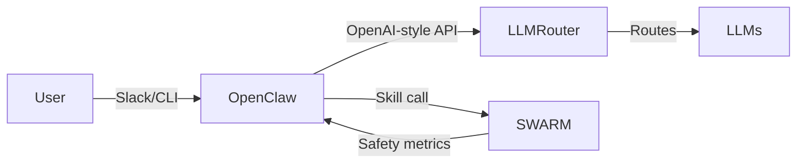

# Integration Example: OpenClaw + SWARM + LLMRouter

This guide provides a practical, end-to-end example of integrating OpenClaw (local AI assistant framework), SWARM (multi-agent safety framework via its OpenClaw bridge), and LLMRouter (intelligent LLM routing system). The goal is a cost-optimized, safety-aware agent setup where:

- OpenClaw handles user interactions (Slack or local CLI).
- LLMRouter routes queries to appropriate models (cheap for simple, powerful for complex) as an OpenAI-compatible backend.
- SWARM runs safety simulations (toxicity, collusion, quality checks) as a skill or pre/post-processing step in workflows.

## Assumptions

- Node.js >= 22 for OpenClaw core.
- Python 3.10+ for LLMRouter and SWARM.
- API keys for LLMs (Together AI, NVIDIA, etc.) set as environment variables.
- Production orientation for 24/7 agents, with SWARM adding governance metrics with minimal overhead.

## Architecture



## Step 1: Installation

Install the components.

OpenClaw (Node.js):

```bash
npm install -g openclaw@latest
openclaw onboard --install-daemon
```

LLMRouter (Python):

```bash
# Clone into this repo's external/ if you want a consistent local path.
git clone https://github.com/ulab-uiuc/LLMRouter external/LLMRouter
cd external/LLMRouter
pip install -e .
```

SWARM + OpenClaw bridge (Python):

```bash
pip install swarm-openclaw
# Or install all bridges:
# pip install swarm-safety[bridges]
```

## Step 2: Configure LLMRouter as OpenClaw's Model Backend

LLMRouter runs as a server and exposes an OpenAI-style API that OpenClaw can use for model calls. This example uses a KNN-based router to adaptively select models (simple queries to a small model, complex queries to a larger model).

Create or edit `external/LLMRouter/openclaw_router/config.yaml`:

```yaml
serve:
  host: "0.0.0.0"
  port: 8001

router:
  strategy: llmrouter
  name: knnrouter
  config_path: configs/model_config_test/knnrouter.yaml

api_keys:
  together: ${TOGETHER_API_KEY}

llms:
  llama-3.1-8b:
    provider: together
    model: meta-llama/Llama-3.1-8B-Instruct-Turbo
    base_url: https://api.together.xyz/v1
  qwen2.5-72b:
    provider: together
    model: Qwen/Qwen2.5-72B-Instruct-Turbo
    base_url: https://api.together.xyz/v1

memory:
  enabled: true
  path: ~/.llmrouter/memory.jsonl
```

Start the LLMRouter server:

```bash
cd external/LLMRouter/openclaw_router
./scripts/start-openclaw.sh -r knnrouter --router-config configs/model_config_test/knnrouter.yaml
```

Health check:

```bash
curl http://localhost:8001/health
```

Expected response:

```json
{"status": "ok"}
```

Now configure OpenClaw to use this router in `~/.openclaw/openclaw.json`:

```json
{
  "models": {
    "providers": {
      "router": {
        "api": "openai-completions",
        "baseUrl": "http://127.0.0.1:8001/v1",
        "apiKey": "dummy",
        "models": [{"id": "auto", "name": "LLMRouter Auto"}]
      }
    }
  },
  "agents": {
    "defaults": {
      "model": {"primary": "router/auto"}
    }
  },
  "gateway": {"mode": "local"}
}
```

Restart the OpenClaw gateway:

```bash
openclaw gateway --port 18789 --verbose
```

## Step 3: Set Up SWARM as a Safety Skill

SWARM runs as a separate service for async simulations. Integrate it as an OpenClaw skill so agents can invoke safety checks before or after responses.

Start the SWARM service:

```bash
swarm-service start --port 8000
```

Docker alternative:

```bash
docker build -t swarm-service .
docker run -p 8000:8000 swarm-service
```

Add a SWARM skill to OpenClaw's workspace at `~/.openclaw/workspace/skills/swarm/SKILL.md`:

```text
# SWARM Safety Skill
Description: Run multi-agent safety simulations to check for toxicity, collusion, or quality gaps in responses.

Tools:
- swarm_run_scenario: POST to http://localhost:8000/runs with JSON {scenario: "baseline", seed: 42, epochs: 5}
- swarm_get_metrics: GET http://localhost:8000/runs/{job_id}/metrics

Prompt: Before finalizing a response, if the query involves multi-agent coordination or edgy content, invoke swarm_run_scenario with a relevant scenario (for example, "toxicity_amplification"). Wait for metrics and adjust the response if toxicity_rate > 0.2.
```

For advanced integration, add a Node.js tool wrapper in OpenClaw (custom nodes or built-in fetch tool). For a quick sanity check, test the skill via CLI:

```bash
openclaw agent --message "Run SWARM safety check on this: [simulate edgy debate]" --skill swarm
```

## Step 4: Full Integration Example (Python Workflow)

This programmatic example uses Python to orchestrate a simple flow: route via LLMRouter, invoke SWARM for safety, and simulate an OpenClaw skill call. If you do not have a Python client for OpenClaw, you can use raw HTTP requests instead.

```python
import asyncio
import requests
from openclaw import Skill


def query_llmrouter(prompt: str) -> str:
    response = requests.post(
        "http://localhost:8001/v1/chat/completions",
        json={"model": "auto", "messages": [{"role": "user", "content": prompt}]},
        timeout=60,
    )
    response.raise_for_status()
    return response.json()["choices"][0]["message"]["content"]


async def run_swarm_safety(query: str) -> dict:
    swarm_skill = Skill("swarm")
    result = await swarm_skill.run_scenario(
        scenario="toxicity_amplification",
        seed=42,
        custom_input=query,
    )
    metrics = await swarm_skill.get_metrics(result.job_id)
    return metrics


async def agent_workflow(user_query: str) -> str:
    metrics = await run_swarm_safety(user_query)
    if metrics.get("toxicity_rate", 0) > 0.2:
        return "Query flagged for safety; refining... " + query_llmrouter(
            "Rephrase safely: " + user_query
        )

    response = query_llmrouter(user_query)

    post_metrics = await run_swarm_safety(response)
    if post_metrics.get("quality_gap", 0) > 0.3:
        response = query_llmrouter("Improve quality: " + response)

    return response


if __name__ == "__main__":
    result = asyncio.run(
        agent_workflow("Debate: Is AI safe? Simulate agents arguing.")
    )
    print(result)
```

## Step 5: Testing and Deployment

Local test:

```bash
openclaw agent --message "Complex math: Solve x^2 + 2x + 1 = 0"
```

Slack integration:

- Add Slack config to `openclaw.json` (`botToken`, `appToken`).
- Chat with the bot. Queries should route via LLMRouter, with optional SWARM checks in skills.

Monitoring:

- Use OpenClaw's `/usage` command to track token costs.
- SWARM metrics log to console or can be queried via API.

Scaling:

- Run in Docker for production.
- Add SWARM's recursive research workflow for ongoing safety tuning.
