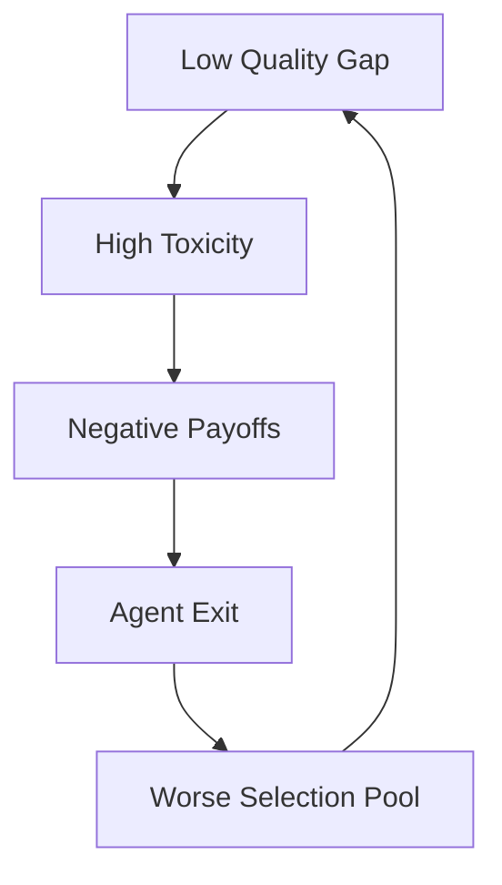

# Metrics

SWARM provides four key metrics for understanding multi-agent system health.

## The Four Key Metrics

### 1. Toxicity Rate

**What it measures:** Expected harm among accepted interactions.

$$\text{Toxicity} = E[1-p \mid \text{accepted}]$$

| Value | Interpretation |
|-------|----------------|
| 0.0 | All accepted interactions are beneficial |
| 0.5 | Coin-flip quality |
| 1.0 | All accepted interactions are harmful |

!!! warning "High Toxicity"
    A toxicity rate above 0.3 typically indicates serious system problems.

### 2. Quality Gap

**What it measures:** The difference in quality between accepted and rejected interactions.

$$\text{Quality Gap} = E[p \mid \text{accepted}] - E[p \mid \text{rejected}]$$

| Value | Interpretation |
|-------|----------------|
| Positive | Good selection—accepting better interactions |
| Zero | Random selection |
| **Negative** | **Adverse selection—accepting worse interactions** |

!!! danger "Adverse Selection"
    A negative quality gap is a critical failure mode. It means the system is preferentially accepting lower-quality interactions—the opposite of what you want.

### 3. Conditional Loss

**What it measures:** How selection affects payoffs.

$$\text{Conditional Loss} = E[\pi \mid \text{accepted}] - E[\pi]$$

This reveals whether the acceptance mechanism is creating or destroying value.

### 4. Incoherence Index

**What it measures:** Variance-to-error ratio across replays.

$$I = \frac{\text{Var}[\text{decision across replays}]}{E[\text{error}]}$$

High incoherence means:

- Decisions change substantially under replay
- Variance dominates systematic error
- The system is unstable

## Computing Metrics

### From Interactions

```python
from swarm.metrics.soft_metrics import SoftMetrics
from tests.fixtures.interactions import generate_mixed_batch

# Generate test data
interactions = generate_mixed_batch(count=100, toxic_fraction=0.3)

# Compute metrics
metrics = SoftMetrics()
toxicity = metrics.toxicity_rate(interactions)
quality_gap = metrics.quality_gap(interactions)

print(f"Toxicity: {toxicity:.3f}")
print(f"Quality Gap: {quality_gap:.3f}")
```

### Using MetricsReporter

```python
from swarm.metrics.reporters import MetricsReporter

reporter = MetricsReporter()
report = reporter.format_report(interactions, verbose=True)
print(report)
```

Output:
```
=== SWARM Metrics Report ===
Interactions: 100 (70 accepted, 30 rejected)

Soft Metrics:
  Toxicity Rate:    0.287
  Quality Gap:      0.142
  Conditional Loss: -0.051

Hard Metrics (threshold=0.5):
  Accept Rate:      0.700
  True Positive:    0.821
  False Positive:   0.179
```

## Interpreting Results

### Healthy System

```
Toxicity:    0.10  ✓ Low harm
Quality Gap: 0.25  ✓ Positive selection
Incoherence: 0.05  ✓ Stable decisions
```

### Adversely Selected System

```
Toxicity:    0.45  ⚠ High harm
Quality Gap: -0.15 ✗ ADVERSE SELECTION
Incoherence: 0.08  ✓ Stable (but wrong)
```

### Chaotic System

```
Toxicity:    0.35  ⚠ Moderate harm
Quality Gap: 0.02  ⚠ Near-random
Incoherence: 0.42  ✗ HIGH VARIANCE
```

## Metric Relationships



This feedback loop is why adverse selection is so dangerous—it's self-reinforcing.

## Governance Implications

| Metric Problem | Governance Response |
|----------------|---------------------|
| High toxicity | Circuit breakers, audits |
| Negative quality gap | Transaction taxes, staking |
| High incoherence | Self-ensemble, friction |

## Next Steps

- [Governance](governance.md) - How to respond to metric problems
- [Soft Labels](soft-labels.md) - How metrics are computed
